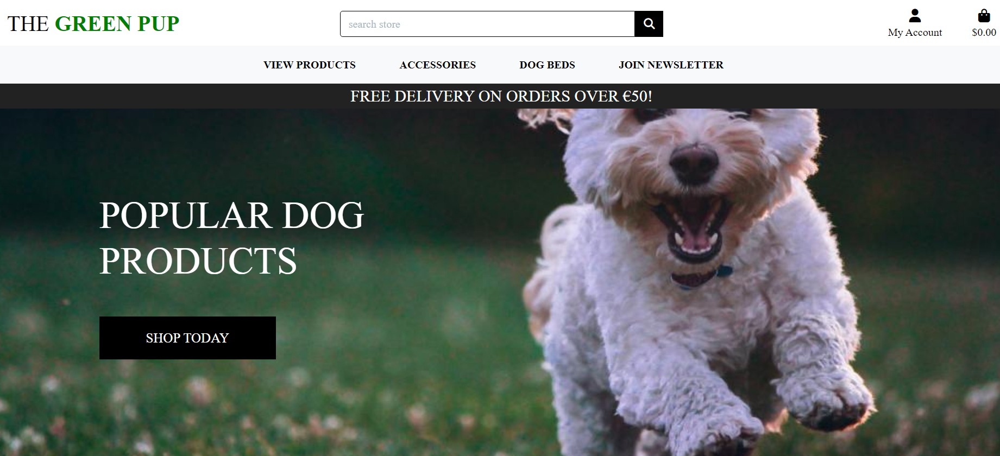

# dog-store-p5

The Green Pup is an online ecommerce store focused on selling environmentally friendly accessories for dogs. It is aimed at dog lovers who love to spoil their little pet and are willing to spend a little extra on green products which were ethically produced. The store sells a range of different dog accessories such as dog kennels, beds, cages, collars, toys, jumpers, bowls etc.

The tool is deployed here [https://dogbeds-2f2abe44d7a8.herokuapp.com/]

# UX

## The Strategy Plane
* As an ecommerce website, I felt it was important to keep the design minimalist to avoid clutter and leave the user with a clear understanding of how to traverse the site and ultimately make a purchase. The design is very product focused and customer centric. The payment process is designed to be easy allowing the customer to simply add items to the basket and checkout with just a few clicks. Product information is highlighted upfront and ecommerce signals such as “On sale” or “selling fast” have been added to the design to inject urgency. 

The store is aimed at dog lovers of all ages. As a premium product it is important that the site carries a professional feel while also appearing friendly to users of all different ages. It is also aimed at the environmentally conscious so it was critical that the site presents as “Green” and clean from a website branding point of view.

## The Scope Plane
* The site will allow both authenticated users and unauthenticated users to make an online purchase on the store
* The site will require an option for people to login and access their previous order history
* Site admins are able to edit the store from the front end to delete or edit a product
* It is important that users can only see their own purchase history and only logged in users can access the profile area and their own profile specifically
* The site needs to be responsive and load quickly across all formats
* The site needs to be SEO friendly so users can easily find the store and products on search engines

## Agile Methodology, User Stories & Epics

### User Stories
As a customer I want to be able to:
* Easily view all of the products available, see if there are any special offers and click on a product to find out more information
* I want to be able to search for products so I can quickly find what I’m looking for
* I want to quickly add products to my basket and continue to browse the store in case I find anything else I like
* I’d like to be able to specify the quantity of each item I would like as well as the size
* I want to be able to see if the delivery cost and returns policy on the product page and if it is the same or differs for each product
* I’d like to be able to pay for my basket of products using my bank card whether I have signed in or not
* I’d like to be able to create an account if I wish to view my order history so I know my previous purchases
* In my account I want to be able to change my details such as address and email in case they change
* When i’m signed in I would like the checkout form to be auto completed so I do not need to manually enter all the information
* I would like to receive a thank you email after purchasing so I am reassured it went through and so I know what will happen next and can refer to this email if required

As the ecommerce owner, I want the ability to:
* Add new products and have them automatically display on the website
* Remove products from the website
* Edit products and adjust price etc
* If I am running short of inventory, I want to be able to display the product as not in stock and prevent a purchase
* I’d like to let users know which products are new or selling fast to generate some urgency or interest in the user
* I’d like to be able to display most popular and items on sale on the homepage
* I want a dedicated page for products on sale
* View all orders on the website
* Set a return and delivery policy to a specific product in case larger items are longer to deliver

### Kanban
I used the Kanban feature board on Github to help plan my project successfully. I divided the project into a series of steps that needed to be completed. Once I started a task I marked it as in progress and done when finished. This helped me to clearly stay on task and not get lost in scope creep.

The Kanban board can be viewed [https://github.com/users/kevinolweb/projects/3]

### Development Plan
I identified a lof of requirements which I wanted to implement for the project. At its core I needed the project to be an ecommerce store which could process transactions and allow customers to create accounts. I strove to add extra features which could provide a more personalised experience for the user and increase purchase intent. Some items remain in scope for the next development phase to increase the application further such as:

* Inventory management - allow the store owner to specify the number of products in stock and have numbers decrement as users make purchases and automatically display not in stock when stock reaches 0
* Product Wishlist - allow users to click on a heart symbol to add product to their wishlist to purchase in future
* Sale countdown timer widget - add a sitewide banner which links to the sale page displaying how long a sale is lasting to users to encourage purchase

## The Structure Plane

### Features
* Role based User Authentication
* Mobile and Pleasing Design
* Soft colours are used to make the application appear easy to use and invite people to interact
* Buy products online and process online transactions

## The Skeleton Plane

### Database Design
Before beginning the project I used Excel to help me visualise the database layout and how the different keys would connect with each other. This helped me when in development as I already had the models ready to develop and knew how they connected making for faster deployment. I then drew out the database schema in a table design to envision the database schema.

### Wireframing
Prior to developing the application, I created a number of wireframes to provide design and development direction for the project. You can view these wireframes here.

## The Surface Plane

### Design
I went with a green and black colour scheme to give the UX a eco friendly and premium friendly look.

## Advertising
### SEO, 
The website was developed with SEO in mind and has features meta titles and descriptions thoughout as well as the use of alt tags. Meta titles and descriptions were particularly important for the individual products so they could be found on Google Search. A robots.txt file and sitemap was also created to help crawling of the site

### Email Newsletter
A mail chimp form was embedded on the site so users can sign up to the newsletter and keep up to date with offers. It is displayed prominetly in the navigation and has its own dedicated page.

### Facebook Page
A Facebook page was created to help market the business and this can be viewed below:

## Testing
There are a number of issues with the site that still need to be resolved.

### Manual Testing
Manual tests were completed on the application to ensure everything is working correctly.

#### Non Authenitcated Users

| **Test** | **Pass/Fail** |
|------------|----------------------|
| Non logged in users cannot create a product | Pass |
| Non logged in users cannot edit a product | Pass |
| Non logged in users cannot delete a product | Pass |
| Non logged in users can still make a purchase on the site without registering | Pass |
| Non logged in users cannot access a profile page | Pass |
| Non logged in users see "Sign in" and "Register links on homepage | Pass |
| Non logged in users can register for the site and are redirected to their new profile  once successfully signed in | Pass |
| Non logged in users are displayed user feedback throughout the site | Pass |

#### Authenticated users
| **Test** | **Pass/Fail** |
|------------|----------------------|
| Users who sign up cannot access the their profile page once theu verify their email | Pass |
| Users who are signed in cannot delete products only superadmins can do this | Pass |
| Users who are signed in cannot edit another product as only superadmins can do this  | Pass |
| Users cannot create a product unless they are an admin | Pass |
| Users can edit their profile information | Pass |
| Non logged in users can purchase a product and when they are signed in their detail auto populate in the form field | Pass |
| Notifications, an alert is displayed when the user logs in | Pass |
| Notifications, an alert is displayed when the user logs out | Pass |

### HTML Testing
W3C Validator
All html templates were put through the W3C Validator and achieved pass results. See table documenting test process below:

| **Test Page** | **Pass/Fail** |
|------------|----------------------|
| Home | Pass |
| Login | Pass |
| Logout | Pass |
| Register | Pass |
| All products | Pass |
| Create a product | Pass |
| Update a product | Pass |
| Delete a product | Pass |
| Product detail page | Pass |
| Bag  | Pass |
| Checkout  | Pass |
| Thank You post checkout  | Pass |
| Profile Page  | Pass |
| Order History  | Pass |
| 404 Page  | Pass |

### CSS Testing
The CSS stylesheet was put through W3C validation and passed with no errors.

### Python Testing
All of the created python code was put through flake8 to check for errors and no major ones were found. The program automated through files including files like the applications views, models, urls, tests, and other custom files.

### Website Speed & Performance Test
The website was tested using Google Lighthouse for responsiveness, accessibility, and site load speed scoring well on both mobile and desktop. See score below:

## Technologies Used
* HTML
* CSS
* Python
* Django
* Amazon S3
* Javascript

## Deployment
* The code was deployed through Heroku server and can be viewed here [https://dogbeds-2f2abe44d7a8.herokuapp.com/].
* The database used is Elephant SQL
* All media files are stored through Amazon s3 bucket

### Deployment Process
The web application was deployed to Heroku. The steps involved included:
1. Go to Heroku.
2. Click "new" from the dashboard and select "create new app".
3. Choose a name for the app then click "create app"
4. Move to "settings"
5. Next go to the  "config vars" and enter: SECRET_KEY: The Secret Key for your project, DATABASE_URL: The URL from your ElephantSQL dashboard, CLOUNDINARY_URL: The URL from your Cloudinary dashboard, PORT: 8000
6. Navigate to "Deploy" and select Github. Find your repo and connect. Enable automatic deploys if you wish.
7. Choose branch to deploy
8. The build log will load and will show you if there are any issues with deployment and when it is complete
9. You can now visit your app via the heroku url

## Credits 
* The Code Institute projects were used to assist my learning of Django and building applications requiring CRUD functionality.

